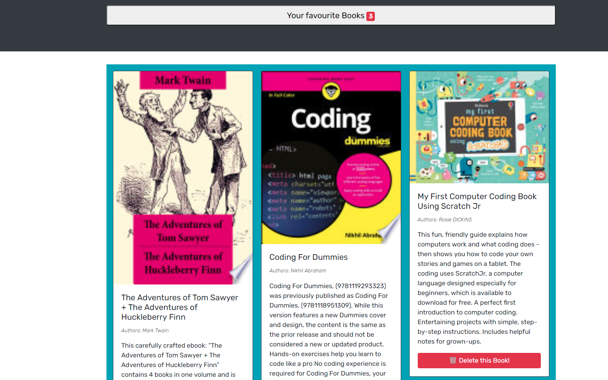
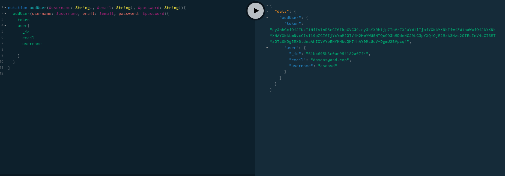
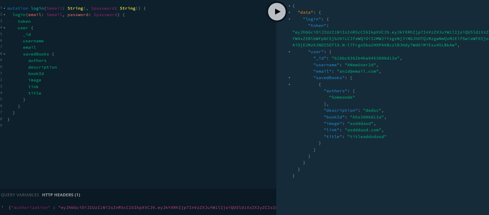
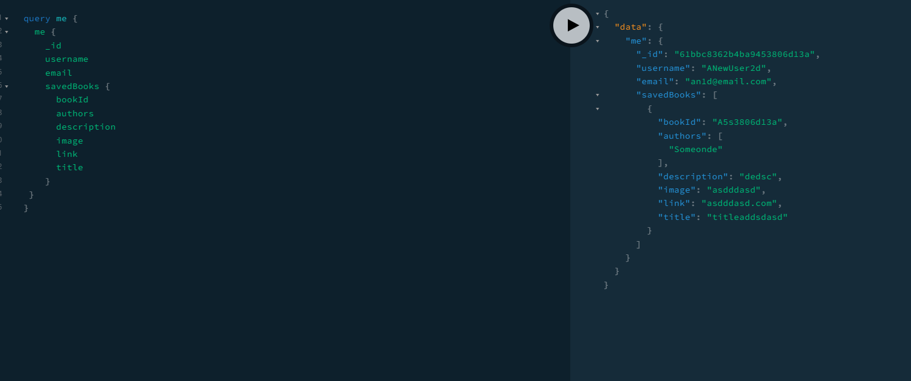
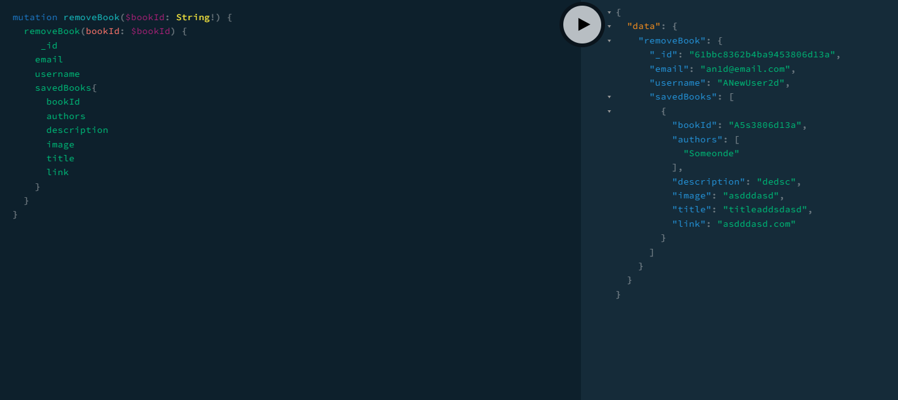
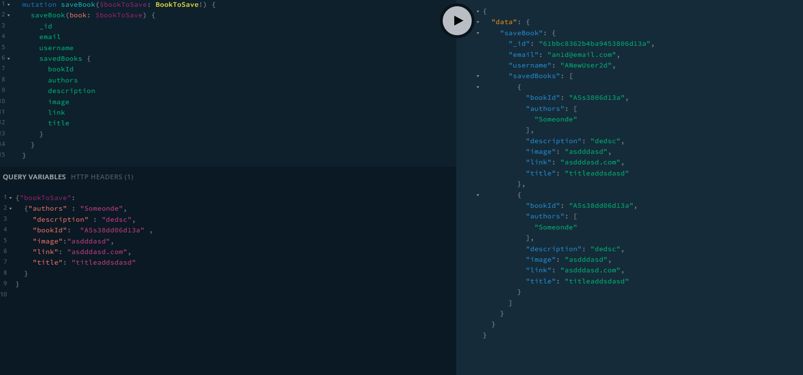

# Google Book Search 

## Description

A google book search with graphQL and mongoDB

## Deployment

https://google-book-search-jc.herokuapp.com/

## Table of contents

- [Installation](#installation)
- [Usage](#usage)
- [License](#license)
- [Questions](#questions)
- [Languages](#languages)
- [Screenshots](#screenshots)

## Installation

from root `run npm i`

## Usage

from root `npm run develop`

## License

This is covered under The MIT License:

## Questions

If you have any questions you can contact me on:
jcourtneywork@gmail.com

my github:
https://github.com/jjcourtney/

## Languages

- 
- 
- 
- 
- 
- 

## Screenshots

